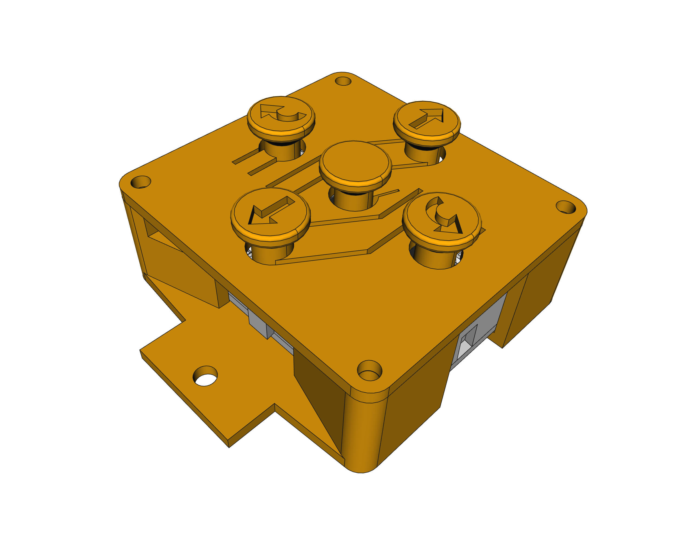
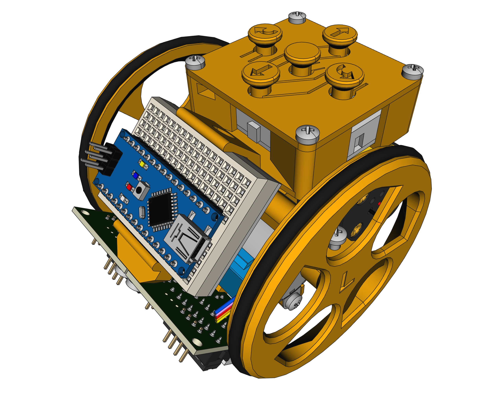
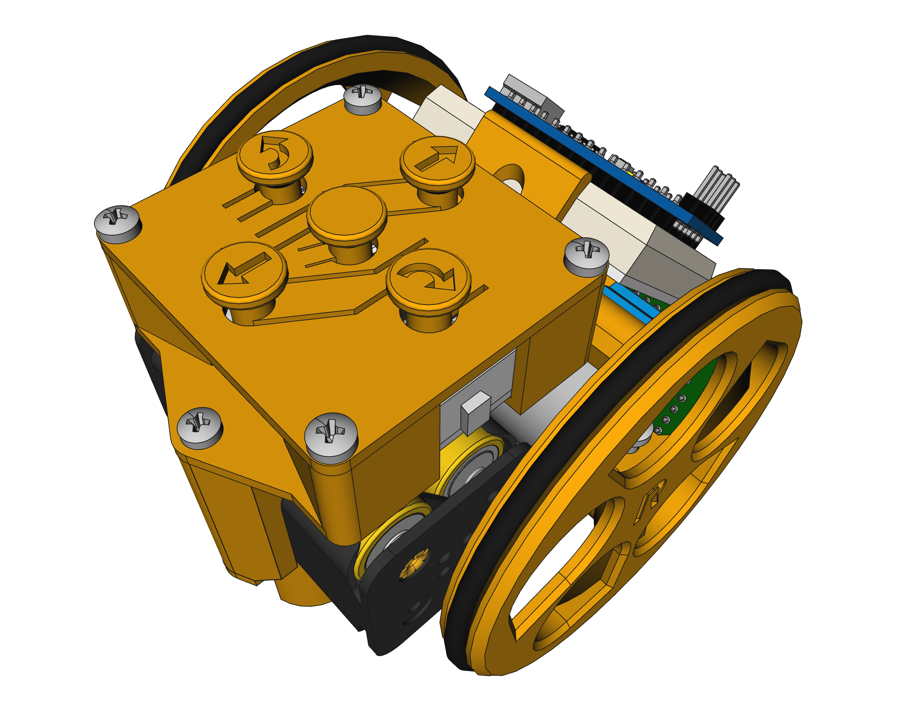
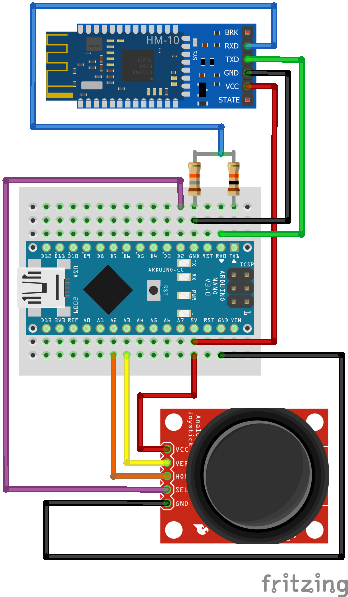

# Escornabot stuff

Different pieces and programs under development.

### [**Keyboard PCBless**](Keyboard_PCBless/)

[3D model](Keyboard_PCBless/3D/Keyboard_PCBless.FCStd) keyboard for Escornabot without using a PBC.

### [**Wireless Joystick Keyboard**](Wireless_Joystick_Keyboard/)

[Arduino code](Wireless_Joystick_Keyboard/code/Wireless_Keyboard.ino) for wireless keyboard using an analog joystick and a HM-10 module.

## LICENSE

This work is licensed under the [GNU General Public License v3.0](LICENSE-GPLV30). All media and data files that are not source code are licensed under the [Creative Commons Attribution 4.0 BY-SA license](LICENSE-CCBYSA40).

More information about licenses in [Opensource licenses](https://opensource.org/licenses/) and [Creative Commons licenses](https://creativecommons.org/licenses/).